### 1.英伟达产品
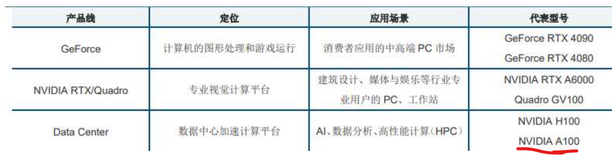
常用A100训练，A10推理
### 2.指标
+ gpu指标：
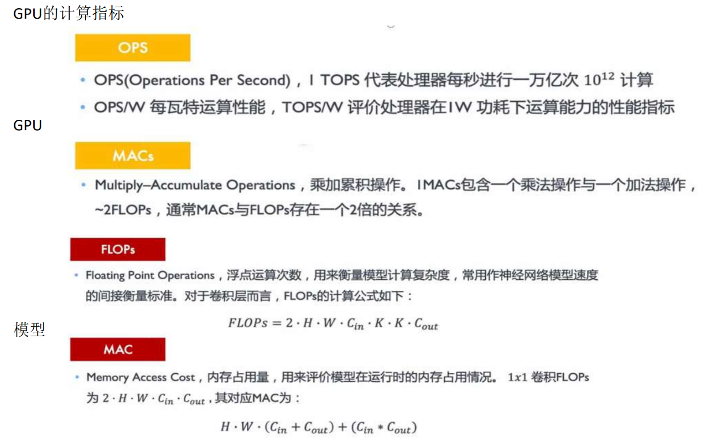
+ ops：每秒运算次数
+ MACs：乘加累计操作。1MACs包含一个乘法操作一个加法操作，~2FLOPs。
+ 模型指标：
  - FLOPs：每秒浮点运算次数，衡量模型计算复杂度，用作模型速度的间接衡量标准。
  - MAC(Memory Access Cost)：内存占用量，评价模型运行时内存占用情况。
  - 1OPS<1FLOPs<2OPS
### 3.大模型计算量计算方法
+ 训练算力需求=模型参数量* 6 * 训练token量 
  - 6：前向计算、求梯度、梯度更新 每个参数算3遍，所以是推理算力的3倍）
+ 推理算力需求=模型参数量* 2* 上下文token量(6b模型100个token，需要算力1200*10亿算力)  
  - 2：加乘运算

  时间=flops/计算量  ？
      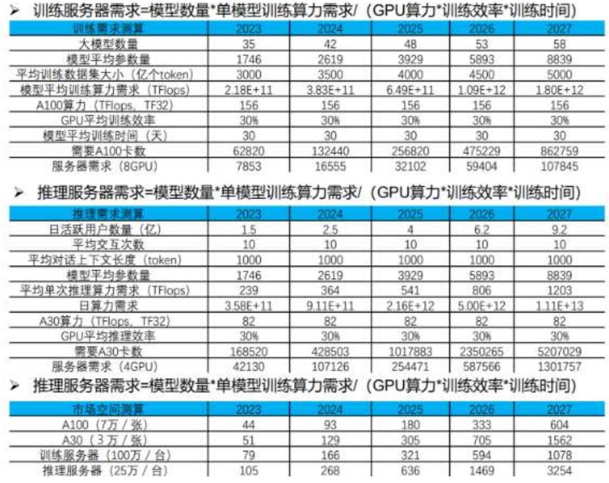
### 4.计算强度
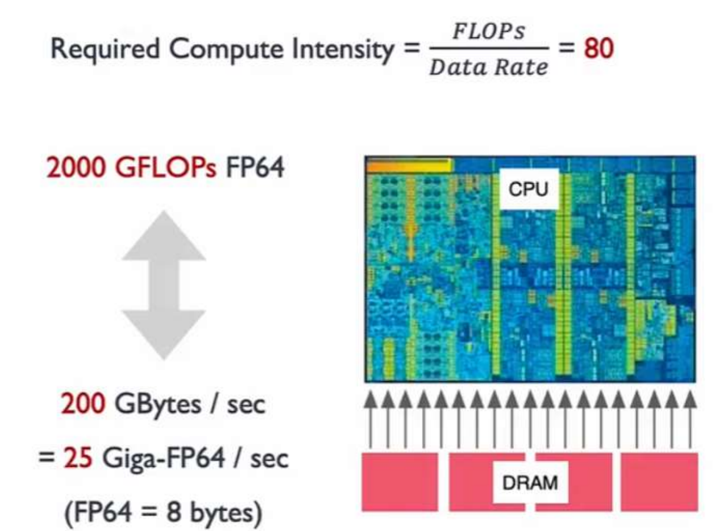
200Bytes/sec:传输速度，Flops：运算速度，计算强度80表示gpu强度高，但计算量不饱和，除非单位时间重复跑80次才能打满
### 5.内存效率
+ 含义：cpu-gpu传输速度/带宽
+ 为防止占用系统内存并提供较高的带宽和较低的延时，GPU均配备有独立的的内存。
### 6.利用率
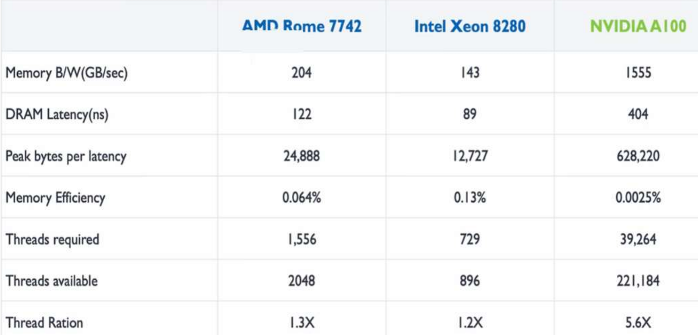
  效率解决：cpu低延迟，gpu多线程（大数据）
### 7. GPU的缓存和计算强度
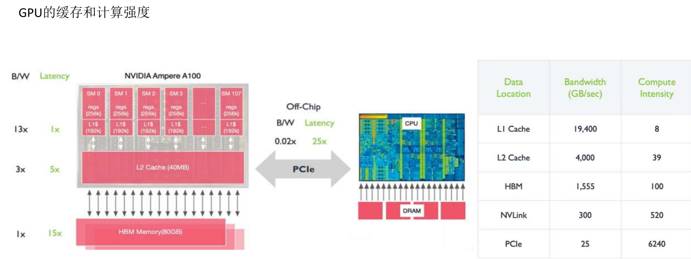
+ DRAM:内存条，HBM：GPU显存
+ L2 Cache，2级缓存 SM：计算单元
+ latency:延迟 B/W：带宽
+ Compute Intensity：计算强度（越小越好）
### 8.
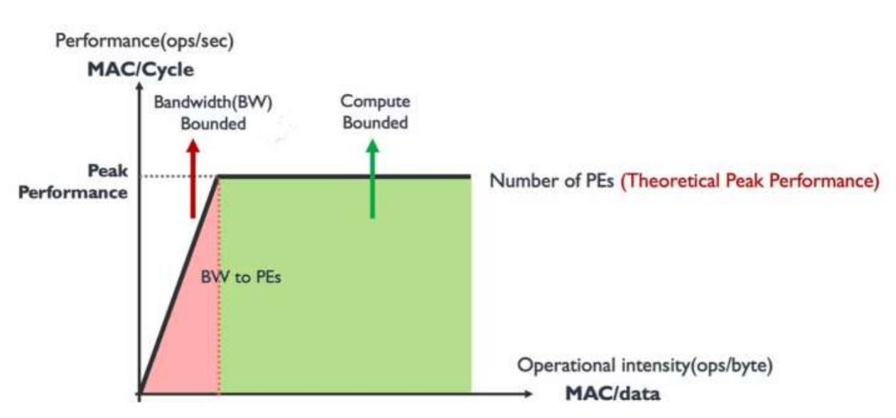
+ 横坐标：计算强度，每个参数需要计算多少次，由模型结构决定
+ 纵坐标：处理器实际表示能力
+ 拐点：最佳位置，榨干gpu性能
### 9.英伟达历代系列
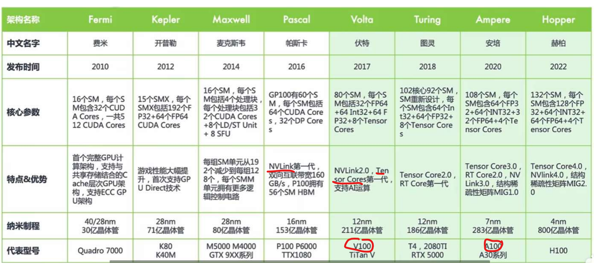
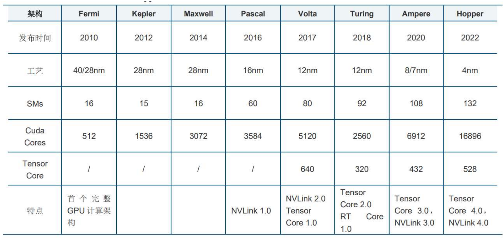
+ 帕斯卡出现NVlink，伏特出现TensorCore，安倍出现稀疏矩阵优化
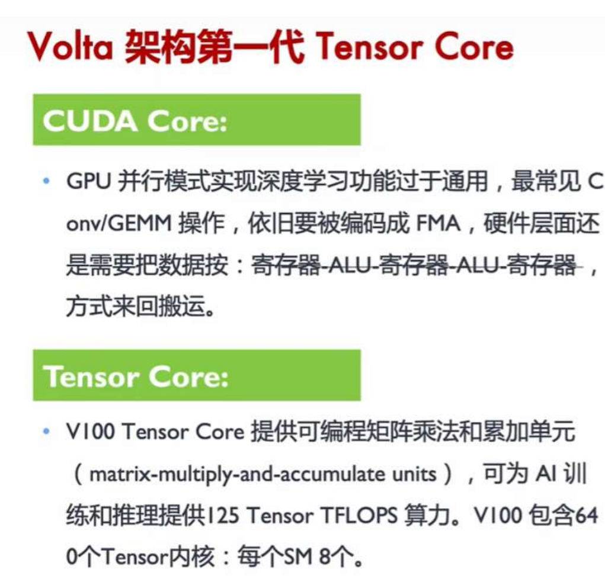
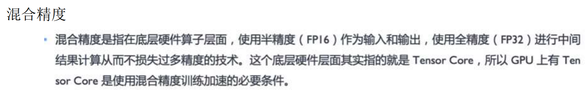
+ TensorCore两大优点：
	- 1.矩阵乘法，并行计算，速度快
	- 2.混合精度，内存有限情况下，提高精度
### 10.gpu通信
+ 传统GPU ,CPU之间通过 PCIe 连接
+ 新生GPU 之间通过 NVLink 连接
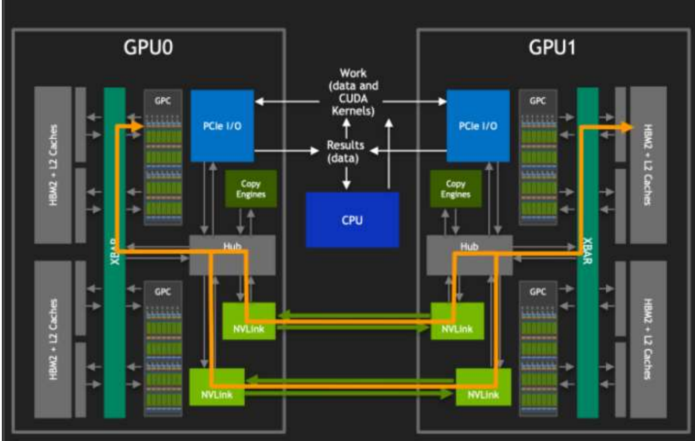
+ NVlink发展
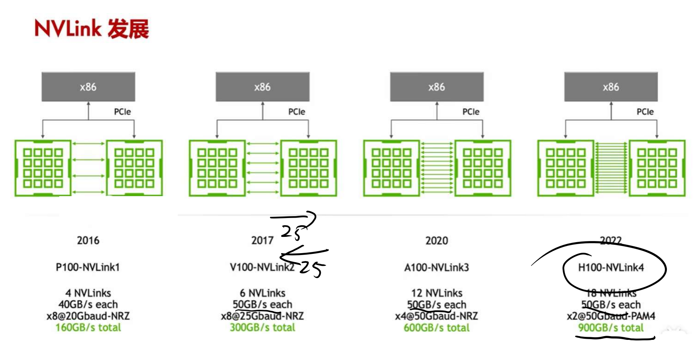

### 11.GPU购买指南
+ 1.价格，每天波动，政策/汇率相关
+ 2.训练还是推理
+ 3.nvLink还是PCIe
+ 4.显存，训练是推理3倍
+ 5.算力大小，主要场景，机器预估
+ 6.选择不多，H100(买不到)>A100>V100>A6000>A10
#### 经验
+ 1.注意新价格买2手
+ 2.原包：2C,3年保质期，全国联保，厂包：2B剩下的，保质期1年，无全国联保